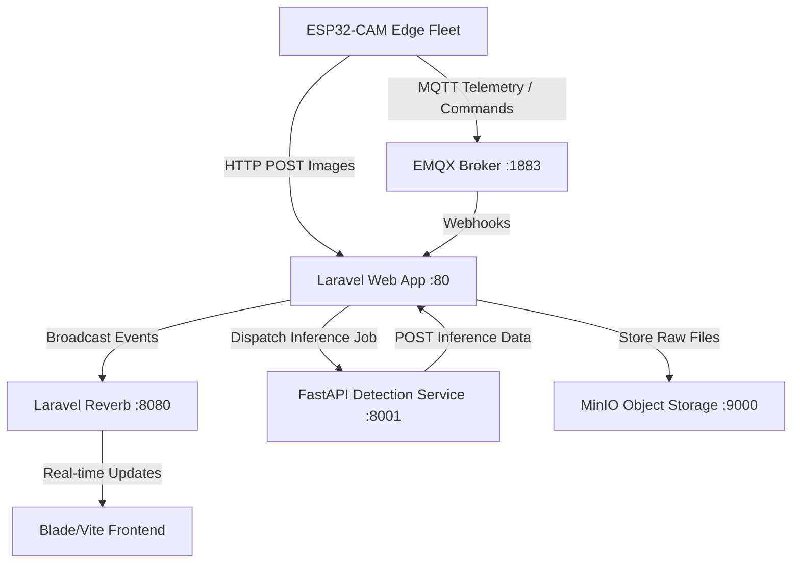

# Mivion IoT Surveillance & Fleet Management Platform

[](https://laravel.com)
[](https://php.net)
[](https://fastapi.tiangolo.com)
[](https://www.docker.com)
[](https://opensource.org/licenses/MIT)

Mivion is a premium, real-time IoT surveillance platform designed for managing and orchestrating fleets of edge cameras (such as ESP32-CAMs). It integrates real-time telemetry ingestion, secure MQTT signaling, automated OTA firmware updates, MinIO-based S3 object storage, and automated machine learning image inference.

---

## Table of Contents

1. [System Architecture](#system-architecture)
2. [Prerequisites](#prerequisites)
3. [Environment Configuration](#environment-configuration)
4. [Docker-Compose Quickstart](#docker-compose-quickstart)
5. [Host-Based Local Installation](#host-based-local-installation)
6. [Services Configuration](#services-configuration)
   - [EMQX (MQTT Broker)](#emqx-mqtt-broker)
   - [MinIO (Object Storage)](#minio-object-storage)
   - [Laravel Reverb (WebSockets)](#laravel-reverb-websockets)
   - [FastAPI (Detection Service)](#fastapi-detection-service)
7. [Database Initialization & Seeding](#database-initialization--seeding)
8. [Queue Workers & Scheduler](#queue-workers--scheduler)
9. [Automated OTA Firmware Deployments](#automated-ota-firmware-deployments)
10. [Storage & Image Cleanup Policy](#storage--image-cleanup-policy)
11. [Troubleshooting & FAQs](#troubleshooting--faqs)
12. [License](#license)

---

## System Architecture

Mivion utilizes a decoupled microservices architecture coordinated via Docker Compose:



* **Web Platform (Laravel 11)**: Manages camera registration, OTA policies, configurations, security roles, and telemetry logs.
* **MQTT Broker (EMQX v5)**: Routes telemetry payloads, monitors edge client online/offline states via webhooks, and publishes configuration commands back to devices.
* **Object Storage (MinIO)**: S3-compatible local bucket system used for storing raw captured JPEG images and compiling `.bin` firmware artifacts.
* **Real-time Server (Laravel Reverb)**: High-performance WebSocket engine that updates the dashboard UI instantly without page refreshes.
* **AI Inference (FastAPI)**: Evaluates uploaded camera images for person/object detection, returning confidence boundaries back to Laravel.

---

## Prerequisites

* **Docker & Docker Compose** (Highly Recommended)
* **PHP >= 8.2** and **Composer** (for local installation)
* **Node.js >= 18** and **NPM** (for compiling frontend assets)
* **MySQL 8.0** or MariaDB

---

## Environment Configuration

1. Copy the example environment template:
   ```bash
   cp .env.example .env
   ```

2. Key environment variables to configure in your `.env`:

   ```ini
   # App Details
   APP_ENV=local
   APP_DEBUG=true
   APP_URL=http://localhost

   # Database (Inside Docker Network)
   DB_CONNECTION=mysql
   DB_HOST=mysql
   DB_PORT=3306
   DB_DATABASE=Sistem_Camera_MIOT
   DB_USERNAME=db_user
   DB_PASSWORD=db_password

   # MinIO / S3 Configuration
   AWS_ACCESS_KEY_ID=minioadmin
   AWS_SECRET_ACCESS_KEY=minioadmin
   AWS_DEFAULT_REGION=us-east-1
   AWS_BUCKET=cctv
   AWS_URL=http://localhost:9000/cctv
   AWS_ENDPOINT=http://minio:9000
   AWS_USE_PATH_STYLE_ENDPOINT=true

   # Laravel Reverb (WebSockets)
   REVERB_APP_ID=534729
   REVERB_APP_KEY=mivionreverbkey123
   REVERB_APP_SECRET=mivionreverbsecret123
   REVERB_HOST=0.0.0.0
   REVERB_PORT=8080
   REVERB_SCHEME=http

   # EMQX Credentials
   EMQX_API_KEY=c638ca43cc860c26
   EMQX_API_SECRET=kDM2eSlUtI7fOz9AErm3tcqcd8BEweJnNEfWgxdpOWVH
   ```

---

## Docker-Compose Quickstart

To run the entire system in containerized mode:

1. Build and start the containers:
   ```bash
   docker compose up -d --build
   ```

2. Run migrations and seeders inside the application container:
   ```bash
   docker compose exec app php artisan migrate --seed
   ```

3. Open your browser and navigate to:
   * Web App: [http://localhost](http://localhost)
   * EMQX Dashboard: [http://localhost:18083](http://localhost:18083) (User: `admin`, Pass: `public`)
   * MinIO Console: [http://localhost:9001](http://localhost:9001) (User: `minioadmin`, Pass: `minioadmin`)
   * phpMyAdmin: [http://localhost:8085](http://localhost:8085) (User: `root`, Pass: `root`)

---

## Host-Based Local Installation

If you prefer running the services directly on your host machine without containerizing the Laravel application:

1. Install Composer dependencies:
   ```bash
   composer install
   ```

2. Install Node modules and build assets:
   ```bash
   npm install
   npm run build
   ```

3. Run migrations and database seeds:
   ```bash
   php artisan migrate --seed
   ```

4. Serve the Laravel application:
   ```bash
   php artisan serve
   ```

5. Run Reverb WebSocket Server:
   ```bash
   php artisan reverb:start
   ```

---

## Services Configuration

### EMQX (MQTT Broker)
Edge cameras publish telemetry to `ws/camera/{device_id}/telemetry` and subscribe to `ws/camera/{device_id}/config` or `/ota`.
* **Action:** To synchronize client connections, you must configure EMQX webhooks to forward connection events (`client.connected`, `client.disconnected`) to the Laravel endpoint: `http://<your-laravel-host>/api/mqtt-webhook`.

### MinIO (Object Storage)
* **Action:** Log into the MinIO Console (`http://localhost:9001`), go to **Buckets**, and create a bucket named `cctv`.
* **Important:** Ensure the bucket policy is set to **Public** (or configure appropriate read access) so that browser clients can load camera snapshot feeds directly from S3.

### Laravel Reverb (WebSockets)
Reverb is automatically run as a daemon within the containerized setup. If you are developing locally, run `php artisan reverb:start`. The frontend Vite compiler will bind WebSocket listeners to Reverb using variables prefixed with `VITE_REVERB_*`.

### FastAPI (Detection Service)
The detection service runs in a Python 3.10 environment inside `detection-service/`.
* **Local Run:**
  ```bash
  cd detection-service
  pip install -r requirements.txt
  uvicorn app.main:app --host 0.0.0.0 --port 8001 --reload
  ```
* **Variables:** Set `LARAVEL_API_URL` to point to the Laravel server so the worker can POST object detection reports back to `/api/detection-feedback`.

---

## Database Initialization & Seeding

Running `php artisan db:seed` registers roles and basic test users:

> [!IMPORTANT]
> **Default Admin Account:**
> Due to a database seeding restriction, the seeders create a default regular user (`user@gmail.com` / `password`). 
> To gain administrator access to register cameras and upload firmware, log in and promote the user, or run Laravel Tinker:
> ```bash
> php artisan tinker
> >>> $user = \App\Models\User::where('email', 'user@gmail.com')->first();
> >>> $user->syncRoles('admin');
> ```

---

## Queue Workers & Scheduler

### Queue Worker (Required)
Image processing, EMQX API synchronization, and object detection jobs are managed asynchronously using Laravel Queues. Run a queue worker:
```bash
php artisan queue:work
```

### Task Scheduler
To handle firmware staged rollout phases and automate log pruning:
1. Add this cron entry to your server:
   ```bash
   * * * * * cd /path-to-your-project && php artisan schedule:run >> /dev/null 2>&1
   ```
2. For testing scheduler jobs locally, run:
   ```bash
   php artisan schedule:work
   ```

---

## Automated OTA Firmware Deployments

Mivion supports staged OTA (Over-the-Air) firmware rollouts:
1. Upload a compiled `.bin` firmware artifact inside **Camera Management > OTA Firmware**. The system automatically generates a versioned `manifest.json` metadata file in MinIO.
2. Create a Deployment targeting a single camera, selected devices, or the entire fleet.
3. Configure a **staged rollout percentage** (e.g., deploy to 10% of devices first).
4. Devices will receive the OTA update trigger topic via MQTT, download the manifest, inspect version checksums, flash the firmware binary, and report progress back to the dashboard via WebSockets.

---

## Storage & Image Cleanup Policy

To prevent database bloating and MinIO disk exhaustion, a scheduled task runs in the background:
* **Pruning Rule:** The system automatically deletes all `ImageRecord` records and their physical JPEG files stored in MinIO that are older than **14 days**.
* **Configuration:** This policy is defined and scheduled in `routes/console.php`.

---

## Troubleshooting & FAQs

### 1. Database migration fails on `2026_06_25_000003_add_ota_fields_to_camera_telemetry_table`
* **Cause:** The `camera_telemetry` base table creation migration was not run or is missing.
* **Fix:** Verify if a migration creating `camera_telemetry` table is present. If missing, generate one or execute a manual query to create the table structure.

### 2. Laravel crashes on boot with `Class "Laravel\Telescope\TelescopeApplicationServiceProvider" not found`
* **Cause:** Telescope is registered in `bootstrap/providers.php` but its dependencies are missing in production because `--no-dev` was used.
* **Fix:** Remove Telescope from the global bootstrap provider array and register it dynamically in `AppServiceProvider`.

### 3. Images uploaded from ESP32-CAMs are not rendering in the browser
* **Cause:** MinIO bucket `cctv` does not exist or has private read policies.
* **Fix:** Create the bucket `cctv` in the MinIO console and set its access policy to **Public**.

---

## License

This project is licensed under the MIT License.
